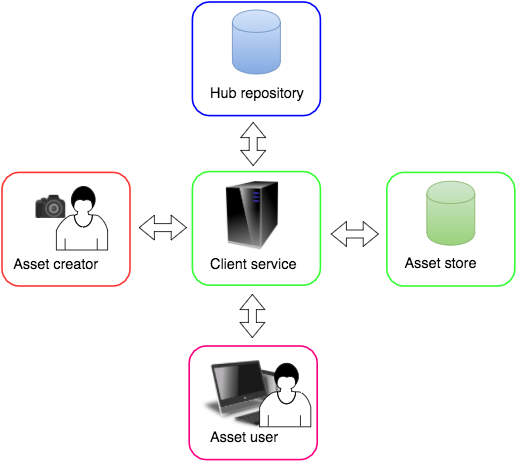

# How to use the Query Service

## Contents

+ [Acronyms](#acronyms)
+ [About this document](#about-this-document)
+ [Overview](#overview)
+ [API status in the current release](#api-status-in-the-current-release)
+ [Example user story](#example-user-story)
+ [Hub Keys](#hub-keys)
+ [Asset IDs](#asset-ids)
+ [Offer IDs](#offer-ids)
+ [The Query Service REST API](#the-query-service-rest-api)
+ [Query examples](#query-examples)  

## Acronyms

| Acronym | Description               |
| :------ | :----------               |
| OPP     | Open Permissions Platform |

## About this document

This How-to describes how to query for asset, offer, and licensor
information using the Open Permissions Platform Query Service.

For issues and support, contact
[support@openpermissions.org](mailto:support@openpermissions.org)
by email.

### See also

+ Hub Keys, and the data they encode, are the items on which asset
  queries are based. To understand more about Hub Keys, see the
  [Hub Key Technical Specification V1](
  https://github.com/openpermissions/support-docs/blob/master/documents/markdown/arch/TECHSPEC_V1.md)
  
## Overview

The OPP Query Service provides an open API that enables any
application client or external party to query for information about
assets that have been onboarded to an OPP repository, and to use the
information returned to query for licensor and offer details.

The Query API accepts unauthenticated requests.

In OPP terminology:

+ **assets** are metadata that describe items of content
+ **offers** are terms under which an asset's content is available for
  use
+ **licensors** are parties that make offers available for an asset

The Query Service is exposed as a REST API.

For full API details, see the [Query Service API Reference](../apiary/api.md).

## API status in the current release

The Query Service API is live in the **current release**.

## Example user story

The purpose of the OPP is to make licensing data about assets, or more
strictly the content that underlies assets, easily discoverable. An
example user story might look like this:



1. Client service Acme Images provides an agency service for
   photographers and publishes their work in an online catalogue. Acme
   uses OPP to store offers and link them to catalogue items
1. Asset creator Nancy is a photographer who uses the Acme service
1. Asset user Judy is a web designer. Judy browses the Acme catalogue
   and finds Nancy's work
1. When Judy selects one of Nancy's photos in the catalogue, the Acme
   catalogue queries OPP to retrieve and display offers for use of the
   photo
1. With a few clicks Judy can complete a transaction to license the
   photo for use in a web site she is designing

## Hub Keys

Hub Keys are true URLs that embed UUIDs generated by an OPP platform
instance with additional information that makes them universally
unique outside the platform instance and web resolvable. Hub Keys are
used to identify assets, offers, and agreements.

In particular, a Hub Key is assigned to each onboarded asset as part
of the onboarding process.

## Source IDs

A source ID is any external identifier used to identify an onboarded
asset. A source ID must always have its **type** specified.

Examples of source ID types include DOIs, ISBNs, as well as arbitrary
types defined by external parties. For example, Acme Image Service
might define its own source ID type:

|Type | Example |
|---|---|
| `source_id_type` | "AcmeCatalogueItem" |
| `source_id` | "A50012345" |

>Within OPP `source_id_types` are case insensitive, as are all other
>identifiers. Within the platform `AcmeCatalogueItem` and
>`acmecatalogueitem` are equivalent.

Note however that a source ID type **must** be registered with admins
of the OPP instance in order for it to be recognised.

See the list of
[Source ID Types](https://github.com/openpermissions/support-docs/blob/master/documents/markdown/types/source-id-types.md)
for currently recognised types.

## Offer IDs

Offers are terms under which a licensor is willing to make an asset
available to would-be users. Offers are identified by UUIDs that may
be embedded in Hub Keys. For example, the following is a well formed
Hub Key that identifies an offer:

`https://openpermissions.org/s1/chf/1451451435345/offer/8f3657697691aed2a2215c7a842f`

with offer ID:

`8f3657697691aed2a2215c7a842f`

## The Query Service REST API

All queries return a JSON object containing either a `data` object and
`status` value or an `errors` object and `status` value.

### Authentication

While all OPP services authenticate using OAuth 2.0 access tokens, the
Query Service also accepts unauthenticated requests.

Application clients can therefore ignore authentication for this API.

## Query examples

The following Python examples show how to use the Query API.

> NOTE: Data will only be found on the staging service if the asset
> has previously been onboarded to the staging service. The staging
> service is not guaranteed to mirror the production service
> repository contents.

For full API details, see the
[Query Service API Reference](../apiary/api.md).

### Query for asset by Hub Key

The simplest query is a query by Hub Key, for example the following
cURL command queries the staging Query Service with the Hub Key
`https://openpermissions.org/s1/hub1/80defa84505f48108858ab653d00aa2f/asset/6732a947b42e43efab8561a856f3352a`:

```
curl -X GET --header "Accept: application/json" 'https://query-stage.copyrighthub.org/v1/query/entities?hub_key=https://openpermissions.org/s1/hub1/80defa84505f48108858ab653d00aa2f/asset/6732a947b42e43efab8561a856f3352a'
```

If the Hub Key is a valid key and the repository in which it is stored
allows `read` permission to all clients, the query returns data for
the asset (pretty-printed below for clarity):

```
{
  "data": {
    "@context": {
      "@language": "en",
      "@vocab": "http://www.w3.org/ns/odrl/2/",
      "constraint": {
        "@container": "@set",
        "type": "@id"
      },
      "dc": "http://purl.org/dc/elements/1.1/",
      "dcterm": "http://purl.org/dc/terms/",
      "duty": {
        "@container": "@set",
        "type": "@id"
      },
      "hub": "http://openlicensing.org/ns/hub/",
      "id": "http://openlicensing.org/ns/id/",
      "odrl": "http://www.w3.org/ns/odrl/2/",
      "ol": "http://openlicensing.org/ns/ol/1.1/",
      "ol:alsoIdentifiedBy": {
        "@container": "@set",
        "type": "@id"
      },
      "olex": "http://openlicensing.org/ns/olex/1.0/",
      "owl": "http://www.w3.org/2002/07/owl#",
      "permission": {
        "@container": "@set",
        "type": "@id"
      },
      "prohibition": {
        "@container": "@set",
        "type": "@id"
      },
      "rdf": "http://www.w3.org/1999/02/22-rdf-syntax-ns#",
      "target": {
        "@container": "@set",
        "type": "@id"
      },
      "xsd": "http://www.w3.org/2001/XMLSchema#"
    },
    "@graph": [
      {
        "@id": "_:f16b5c31d1a09416b82c17075c935283cb1",
        "@type": "ol:Id",
        "ol:id_type": {
          "@id": "hub:examplecopictureid"
        },
        "ol:value": {
          "@value": "1"
        }
      },
      {
        "@id": "id:6732a947b42e43efab8561a856f3352a",
        "@type": [
          "ol:Asset",
          "Offer"
        ],
        "dcterm:description": {
          "@value": "Stock Photo"
        },
        "dcterm:modified": {
          "@type": "xsd:dateTime",
          "@value": "2016-04-15T09:18:24.260000+00:00"
        },
        "ol:alsoIdentifiedBy": [
          {
            "@id": "_:f16b5c31d1a09416b82c17075c935283cb1"
          }
        ]
      }
    ]
  },
  "status": 200
}
```

Entering the Hub Key into a browser navigation bar will return the
same result.

### Query for asset by repository ID and entity type and ID

A Hub Key encodes, among other information:

+ A repository ID
+ An entity type
+ An entity ID

The Query Service supports queries that explicitly specify those
values, for example the following cURL command:

```
curl -X GET --header "Accept: application/json" 'https://query-stage.copyrighthub.org/v1/query/entities/80defa84505f48108858ab653d00aa2f/asset/6732a947b42e43efab8561a856f3352a'
```

returns the same data as the previous query by Hub Key.

### Query for licensors by source type and ID

Using the data returned by either of the queries above, we can query
for the licensors of the asset. The `"@graph"` data includes the
source ID type and value:

```
"ol:id_type": {
	"@id": "hub:examplecopictureid"
	},
	"ol:value": {
		"@value": "1"
	}
```

which we can use in the following cURL command:

```
curl -X GET --header "Accept: application/json" 'https://query-stage.copyrighthub.org/v1/query/licensors?source_id_type=examplecopictureid&source_id=1'
```

which returns licensor data (pretty-printed for clarity):

```
{
  "data": [
    {
      "address": "Example Co\n101 Euston Road London\nNW1 2RA",
      "description": "A fictional company for demo purposes for the OPP project",
      "email": "support@openpermissions.org",
      "id": "exampleco",
      "logo": "https://s3-eu-west-1.amazonaws.com/copyrighthub-matrix-images/logo_exampleco_sm.png",
      "name": "ExampleCo",
      "phone": "0300 1233 101",
      "resolution_redirect": "https://exampleco.digicat.io/exampleco/image?hubid={hub_key}",
      "state": "approved",
      "twitter": "DigiCatapult",
      "website": "http://exampleco.digicat.io"
    },
    {
      "address": "Example Co\n101 Euston Road London\nNW1 2RA",
      "description": "A fictional company for demo purposes for the OPP project",
      "email": "support@openpermissions.org",
      "id": "exampleco",
      "logo": "https://s3-eu-west-1.amazonaws.com/copyrighthub-matrix-images/logo_exampleco_sm.png",
      "name": "ExampleCo",
      "phone": "0300 1233 101",
      "resolution_redirect": "https://exampleco.digicat.io/exampleco/image?hubid={hub_key}",
      "state": "approved",
      "twitter": "DigiCatapult",
      "website": "http://exampleco.digicat.io"
    }
  ],
  "status": 200
}
```

### Query for offers by source type and ID

Similarly, the Query Service supports queries for offers by source
type and ID. Using the same data as above, i.e. `source_id_type` and
`source_id`, but this time as JSON data, the following Python example
returns offer data for the asset:

```python
import json, requests

service = 'https://query-stage.copyrighthub.org'
endpoint = '/v1/query'
resource = '/search/offers'

# JSON data
json_data = json.dumps([{
    'source_id_type': 'examplecopictureid',
    'source_id': '1'
    }])

# Request
r = requests.post(uri,
	data=json_data,
	headers={'Accept':'application/json',
             'Content-Type': 'application/json; charset=utf-8'})

# Pretty print
print json.dumps(json.loads(r.text), sort_keys=True,
    indent=2, separators=(',', ': '))
```

The result is extremely verbose, only a fragment is shown below:

```
{
  "data": [
    {
      "entity_id": "6732a947b42e43efab8561a856f3352a",
      "offers": [
        {
          "@context": {
            "@language": "en",
            "@vocab": "http://www.w3.org/ns/odrl/2/",
            "constraint": {
              "@container": "@set",
              "type": "@id"
            },

	        ... Omitted for brevity

	        {
              "@id": "id:b9fdb19373af44c0b2b0b43b132ed27b",
              "@type": [
                "Constraint",
                "olex:Constraint"
              ],
              "olex:attributeText": "This photograph (c) Test Demo PseudoLtd Ltd, all rights reserved.",
              "operator": {
                "@id": "odrl:eq"
              }
            },
            {
              "@id": "id:01f73073d0a84abea9ba1891bc22a6ef",
              "@type": [
                "Asset",
                "Policy",
                "ol:Policy",
                "Offer"
              ],
              "assigner": {
                "@id": "id:f521281202a746cebdbfbb532027157a"
              },
              "conflict": {
                "@id": "odrl:invalid"
              },
              "dcterm:created": {
                "@type": "xsd:dateTime",
                "@value": "2016-04-13T16:01:00+00:00"
              },
              "dcterm:modified": [
                {
                  "@type": "xsd:dateTime",
                  "@value": "2016-04-15T09:09:13.819000+00:00"
                },
                {
                  "@type": "xsd:dateTime",
                  "@value": "2016-04-13T16:01:00+00:00"
                }
              ],
              "dcterm:title": "Non-commercial Website",
              "duty": [
                {
                  "@id": "id:fc88c1c6fe784936941beb672d456387"
                }
              ],
              "inheritAllowed": false,
              "ol:policyDescription": "Use an image on a blog or website<br/><br/>Site does not carry advertising or sell products or services.<br/>Site receives no more than 50,000 views per month<br/>Maximum size of image 400 x 400px.",
              "permission": [
                {
                  "@id": "id:45b48b17d4214596b743902e2a3289c1"
                }
              ],

	          ... Omitted for brevity
	
            }
          ]
        }
      ],
      "repository": {
        "entity_id": "2de3fe3c0058474cb4162de1c2ba43e2",
        "repository_id": "80defa84505f48108858ab653d00aa2f"
      },
      "source_id": "1",
      "source_id_type": "examplecopictureid"
    }
  ],
  "status": 200
}
```


